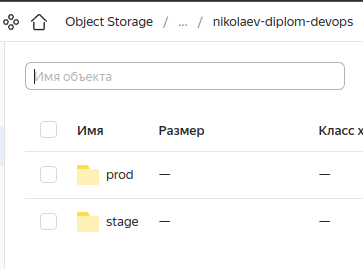
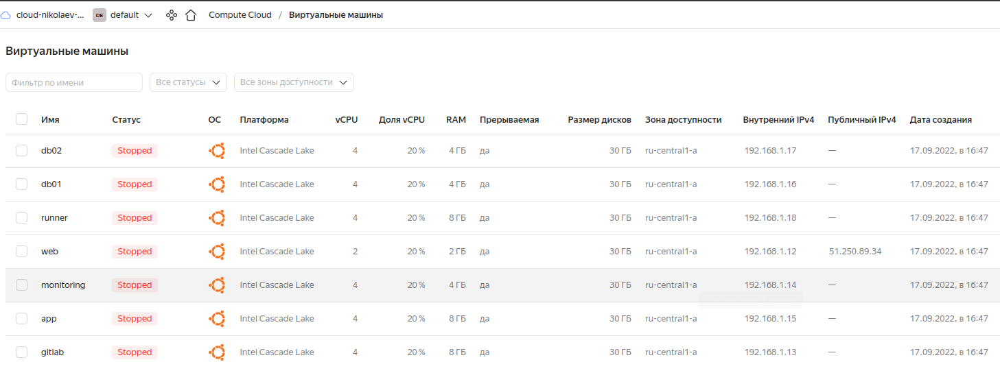
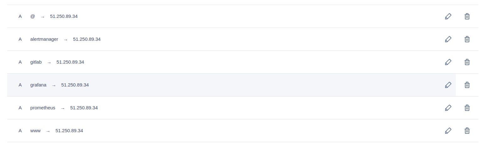
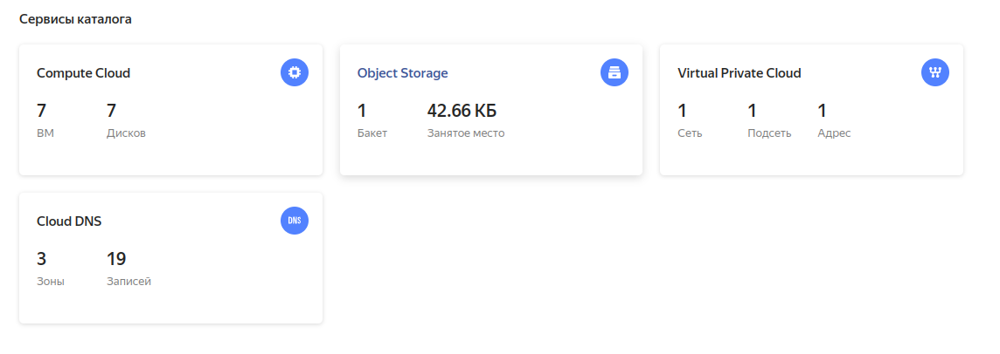
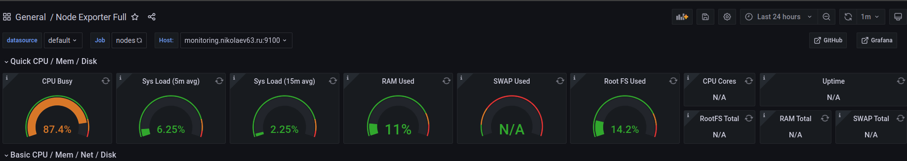

# Дипломный практикум в YandexCloud

### 1. Зарегистрировать доменное имя (любое на ваш выбор в любой доменной зоне).

___

Зарегистрировали доменное имя в https://www.reg.ru/

nikolaev63.ru

### 2. Создание инфраструктуры

1. [Создайте сервисный аккаунт](https://cloud.yandex.ru/docs/iam/operations/sa/create), который будет в дальнейшем использоваться Terraform для работы с инфраструктурой с необходимыми и достаточными правами. Не стоит использовать права суперпользователя

Создаем сервис-аккаунт:
```bash
    ~/devopsdiplom/src/ansible  yc iam service-account create --name nikolaev-diplom 
id: aje*****************
folder_id: b1g*****************
created_at: "2022-09-03T10:29:26.352908008Z"
name: nikolaev-diplom

```
Назначим роль editor
```bash
    ~/devopsdiplom/src/ansible  yc resource-manager folder add-access-binding bb1g***************** --role editor --subject serviceAccount:aje*****************
done (1s)
```
Создадим статический ключ доступа
```bash
    ~/devopsdiplom/src/ansible  yc iam access-key create --service-account-name nikolaev-diplom
access_key:
  id: aje****
  service_account_id: aje****
  created_at: "2022-07-10T23:32:28.323165040Z"
  key_id: YCA**********************
secret: YCM**********************
```

2. Подготовьте [backend](https://www.terraform.io/docs/language/settings/backends/index.html) для Terraform. Остановим выбор на альтернативном варианте:  [S3 bucket в созданном YC аккаунте](https://cloud.yandex.ru/docs/storage/operations/buckets/create).
Создали бакет в YC:



Конфигурация содержится в файле [provider.tf](./src/terraform/provider.tf):

```terraform
variable "domain_name" {
    type        = string
    description = "Наименование основного домена"
}

variable "sa_access_key" {
    type        = string
    description = "Ключ доступа для сервисного аккаунта"
}

variable "sa_secret_key" {
    type        = string
    description = "Секретка для ключа доступа сервисного аккаунта"
}

variable "yc_folder_id" {
    type        = string
    description = "Идентификатор каталога"
}

terraform {
  required_providers {
    yandex = {
      source = "yandex-cloud/yandex"
    }
  }
  required_version = ">= 0.75.0"


  backend "s3" {
  }

}

provider "yandex" {
  folder_id = var.yc_folder_id
  service_account_key_file = file("nikolaev-diplom.json")
  #cloud_id  = "$(var.yc_cloud_id)"
  #zone      = "$(var.yc_zone)"
}
```

### 3. Настройка workspaces 

Создаем workspaces `prod` и `stage`:

```bash 
    ~/devopsdiplom/src/terraform  terraform workspace new prod
Created and switched to workspace "prod"!

You're now on a new, empty workspace. Workspaces isolate their state,
so if you run "terraform plan" Terraform will not see any existing state
for this configuration.
    ~/devopsdiplom/src/terraform  terraform workspace new stage
Created and switched to workspace "stage"!

You're now on a new, empty workspace. Workspaces isolate their state,
so if you run "terraform plan" Terraform will not see any existing state
for this configuration.
```

Проверяем наличие созданных workspace:
```bash
    ~/devopsdiplom/src/terraform  terraform workspace list                                                                       
  default
  prod
* stage

```
</details>

### 4. Создание VPC с подсетями в разных зонах доступности.

Подготовили tf. файлы: 
* `network.tf`
```terraform
resource "yandex_vpc_network" "yc_network" {
  name = "vpc-network-${terraform.workspace}"
  }

resource "yandex_vpc_subnet" "yc_subnet" {
  name           = "yc_subnet"
  zone           = local.vpc_zone[terraform.workspace]
  network_id     = yandex_vpc_network.yc_network.id
  v4_cidr_blocks = local.vpc_subnets_v4-cidr[terraform.workspace]
  route_table_id = yandex_vpc_route_table.route-table-nat-inet.id
}

resource "yandex_vpc_route_table" "route-table-nat-inet" {
    name = "route-table-nat-inet"
    network_id = "${yandex_vpc_network.yc_network.id}"
    static_route {
    destination_prefix = "0.0.0.0/0"
    next_hop_address = "192.168.1.12"
    }
  }
```
</details>

### 5. Убедитесь, что теперь вы можете выполнить команды `terraform destroy` и `terraform apply` без дополнительных ручных действий.

Все ВМ успешно создаются, роли ansible успешно отрабатывают:



---
### 6. Установка Nginx и LetsEncrypt

Необходимо разработать Ansible роль для установки Nginx и LetsEncrypt.

**Для получения LetsEncrypt сертификатов во время тестов своего кода пользуйтесь [тестовыми сертификатами](https://letsencrypt.org/docs/staging-environment/), так как количество запросов к боевым серверам LetsEncrypt [лимитировано](https://letsencrypt.org/docs/rate-limits/).**

Рекомендации:
  - Имя сервера: `mycompanyname.ru`
  - Характеристики: 2vCPU, 2 RAM, External address (Public) и Internal address.

Цель:

1. Создать reverse proxy с поддержкой TLS для обеспечения безопасного доступа к веб-сервисам по HTTPS.

Ожидаемые результаты:

1. В вашей доменной зоне настроены все A-записи на внешний адрес этого сервера:
    - `https://www.nikolaev63.ru` (WordPress)
    - `https://gitlab.nikolaev63.ru` (Gitlab)
    - `https://grafana.nikolaev63.ru` (Grafana)
    - `https://prometheus.nikolaev63.ru` (Prometheus)
    - `https://alertmanager.nikolaev63.ru` (Alert Manager)
2. Настроены все upstream для выше указанных URL, куда они сейчас ведут на этом шаге не важно, позже вы их отредактируете и укажите верные значения.
3. В браузере можно открыть любой из этих URL и увидеть ответ сервера (502 Bad Gateway). На текущем этапе выполнение задания это нормально!

___

1. 
[Резервирование статического IP-адреса по инструкции](https://cloud.yandex.ru/docs/vpc/operations/get-static-ip) 

2. 
Добавление А-записей в DNS нашей доменной зоны:



3. 
Создание ВМ с nginx и letsencrypt. Воспользуемся предварительным конфигом ВМ из предыдущего пункта диплома,
[инструкцией по установке nginx и letsencrypt](https://gist.github.com/mattiaslundberg/ba214a35060d3c8603e9b1ec8627d349) для написания собственной роли по настройке nginx reverse-proxy.

### 7.Установка кластера MySQL

При подготовке ansible роли [mysql](https://github.com/dsnikolaev13/devops-netology/tree/main/diplom/src/ansible/mysql) использовали [готовую роль](https://galaxy.ansible.com/geerlingguy/mysql)

### 8.Установка WordPress

1. [tf-файл ВМ с WordPress](./src/terraform/wordpress.tf)
2. Настроена A-запись в доменной зоне nikolaev63.ru
3. [Upstream для WordPress.](./src/ansible/nginx-proxy/templates/nginx-nikolaev63.j2)

### 9.Установка Gitlab CE и Gitlab Runner

Для установки gitlab и gitlab-runner использовал роли [ansible-gitlab](https://github.com/dsnikolaev13/devops-netology/tree/main/diplom/src/ansible/gitlab) и [ansible-gitlab-runner](https://github.com/dsnikolaev13/devops-netology/tree/main/diplom/src/ansible/gitlab-runner)

Результат работы


### 10.Установка Prometheus, Alert Manager, Node Exporter и Grafana

Добавлен [terraform манифест](./src/terraform/monitoring.tf) для ВМ monitoring.nikolaev63.ru

Роли:
* [grafana](./src/ansible/grafana)
* [prometheus](./src/ansible/prometheus)
* [alertmanager](./src/ansible/alertmanager)
* [node-exporter](./src/ansible/node-exporter)

Результаты работы.

