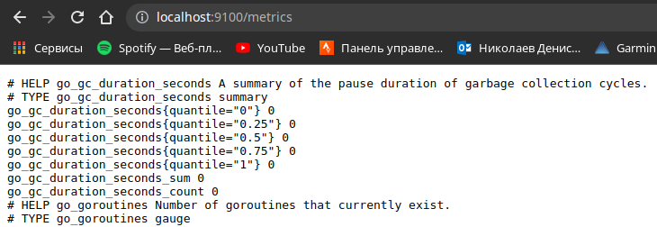
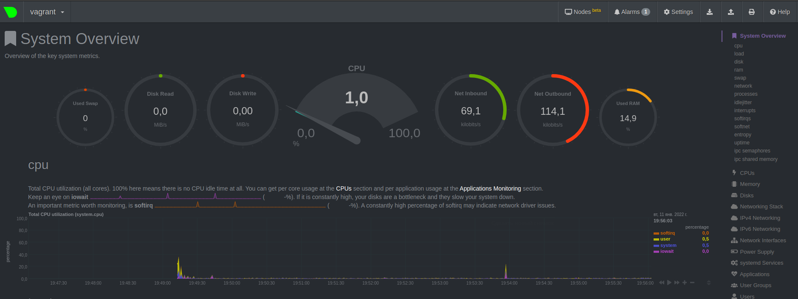

# Домашнее задание к занятию "3.4. Операционные системы, лекция 2"

1. На лекции мы познакомились с [node_exporter](https://github.com/prometheus/node_exporter/releases). В демонстрации его исполняемый файл запускался в background. Этого достаточно для демо, но не для настоящей production-системы, где процессы должны находиться под внешним управлением. Используя знания из лекции по systemd, создайте самостоятельно простой [unit-файл](https://www.freedesktop.org/software/systemd/man/systemd.service.html) для node_exporter:

    * поместите его в автозагрузку,
    * предусмотрите возможность добавления опций к запускаемому процессу через внешний файл (посмотрите, например, на `systemctl cat cron`),
    * удостоверьтесь, что с помощью systemctl процесс корректно стартует, завершается, а после перезагрузки автоматически поднимается.  
    
    **Ответ:**  
    unit-файл
    ```bash
    
        [Unit]
        Description=Prometheus Node Exporter
        Wants=network-online.target
        After=network-online.target

        [Service]
        User=node_exporter
        Group=node_exporter
        Type=simple
        ExecStart=/usr/local/bin/node_exporter

        [Install]
        WantedBy=multi-user.target
    ```
    Процесс корректно стартует, завершается и автоматически поднимается после перезапуска.
    
    ```bash
    
        vagrant@vagrant:~$ ps -e |grep node_exporter 
           802 ?        00:00:00 node_exporter
        vagrant@vagrant:~$ systemctl stop node_exporter
        ==== AUTHENTICATING FOR org.freedesktop.systemd1.manage-units ===
        Authentication is required to stop 'node_exporter.service'.
        Authenticating as: vagrant,,, (vagrant)
        Password: 
        ==== AUTHENTICATION COMPLETE ===
        vagrant@vagrant:~$ ps -e |grep node_exporter
        vagrant@vagrant:~$ systemctl start node_exporter
        ==== AUTHENTICATING FOR org.freedesktop.systemd1.manage-units ===
        Authentication is required to start 'node_exporter.service'.
        Authenticating as: vagrant,,, (vagrant)
        Password: 
        ==== AUTHENTICATION COMPLETE ===
        vagrant@vagrant:~$ ps -e | grep node_exporter
           1620 ?        00:00:00 node_exporter
        vagrant@vagrant:~$ 
    ```
         

1. Ознакомьтесь с опциями node_exporter и выводом `/metrics` по-умолчанию. Приведите несколько опций, которые вы бы выбрали для базового мониторинга хоста по CPU, памяти, диску и сети.

    **Ответ:**  

CPU:
    node_cpu_seconds_total{cpu="0",mode="idle"} 7734.62
    node_cpu_seconds_total{cpu="0",mode="system"} 22.76
    node_cpu_seconds_total{cpu="0",mode="user"} 15.43
    node_cpu_seconds_total{cpu="1",mode="idle"} 7721.39
    node_cpu_seconds_total{cpu="1",mode="system"} 20.54
    node_cpu_seconds_total{cpu="1",mode="user"} 12.62
    
Memory:
    node_memory_MemTotal_bytes 1.028694016e+09
    node_memory_MemFree_bytes 5.03468032e+08
    node_memory_MemAvailable_bytes 6.7905536e+08
    
Disk(если несколько дисков то для каждого):
    node_filesystem_size_bytes{device="vagrant",fstype="vboxsf",mountpoint="/vagrant"} 3.97290139648e+11 
    node_filesystem_avail_bytes{device="vagrant",fstype="vboxsf",mountpoint="/vagrant"} 1.93622646784e+11 
    node_filesystem_free_bytes{device="vagrant",fstype="vboxsf",mountpoint="/vagrant"} 1.93622646784e+11
    node_disk_read_bytes_total{device="sda"} 2.92926464e+08
    node_disk_written_bytes_total{device="sda"} 4.9316864e+07
    
Network(так же для каждого активного адаптера):
    node_network_receive_bytes_total{device="eth0"} 1.697784e+06
    node_network_transmit_bytes_total{device="eth0"} 1.348219e+06  

1. Установите в свою виртуальную машину [Netdata](https://github.com/netdata/netdata). Воспользуйтесь [готовыми пакетами](https://packagecloud.io/netdata/netdata/install) для установки (`sudo apt install -y netdata`). После успешной установки:
    * в конфигурационном файле `/etc/netdata/netdata.conf` в секции [web] замените значение с localhost на `bind to = 0.0.0.0`,
    * добавьте в Vagrantfile проброс порта Netdata на свой локальный компьютер и сделайте `vagrant reload`:

    ```bash
        config.vm.network "forwarded_port", guest: 19999, host: 19999
    ```

    После успешной перезагрузки в браузере *на своем ПК* (не в виртуальной машине) вы должны суметь зайти на `localhost:19999`. Ознакомьтесь с метриками, которые по умолчанию собираются Netdata и с комментариями, которые даны к этим метрикам.

    **Ответ:**  
        Установил Netdata на виртуальную машину, пробросил порты 19999 на локальный компьютер. В браузере `localhost:19999`:  
        
         
 
1. Можно ли по выводу `dmesg` понять, осознает ли ОС, что загружена не на настоящем оборудовании, а на системе виртуализации?  

    **Ответ:**  
    ```bash
         [    0.001274] CPU MTRRs all blank - virtualized system.  
         [    0.054995] Booting paravirtualized kernel on KVM  
         [    0.203462] Performance Events: PMU not available due to virtualization, using software events only.  
         [    3.488197] systemd[1]: Detected virtualization oracle.  
    ```  
    
1. Как настроен sysctl `fs.nr_open` на системе по-умолчанию? Узнайте, что означает этот параметр. Какой другой существующий лимит не позволит достичь такого числа (`ulimit --help`)?  
    **Ответ:**  

    ```bash
    
        vagrant@vagrant:~$ /sbin/sysctl -n fs.nr_open
        1048576
    ```
Это максимальное число открытых дескрипторов для системы, для пользователя задать больше этого числа нельзя. 

    ```bash
    
        vagrant@vagrant:~$ ulimit -Sn
        1024

    ```

мягкий лимит (так же ulimit -n)на пользователя (может быть увеличен процессов в процессе работы) 

    ```bash
    
        vagrant@vagrant:~$ ulimit -Hn
        1048576

    ```

жесткий лимит на пользователя (не может быть увеличен, только уменьшен)

Оба ulimit -n НЕ могут превысить системный fs.nr_open

1. Запустите любой долгоживущий процесс (не `ls`, который отработает мгновенно, а, например, `sleep 1h`) в отдельном неймспейсе процессов; покажите, что ваш процесс работает под PID 1 через `nsenter`. Для простоты работайте в данном задании под root (`sudo -i`). Под обычным пользователем требуются дополнительные опции (`--map-root-user`) и т.д.
1. Найдите информацию о том, что такое `:(){ :|:& };:`. Запустите эту команду в своей виртуальной машине Vagrant с Ubuntu 20.04 (**это важно, поведение в других ОС не проверялось**). Некоторое время все будет "плохо", после чего (минуты) – ОС должна стабилизироваться. Вызов `dmesg` расскажет, какой механизм помог автоматической стабилизации. Как настроен этот механизм по-умолчанию, и как изменить число процессов, которое можно создать в сессии?

